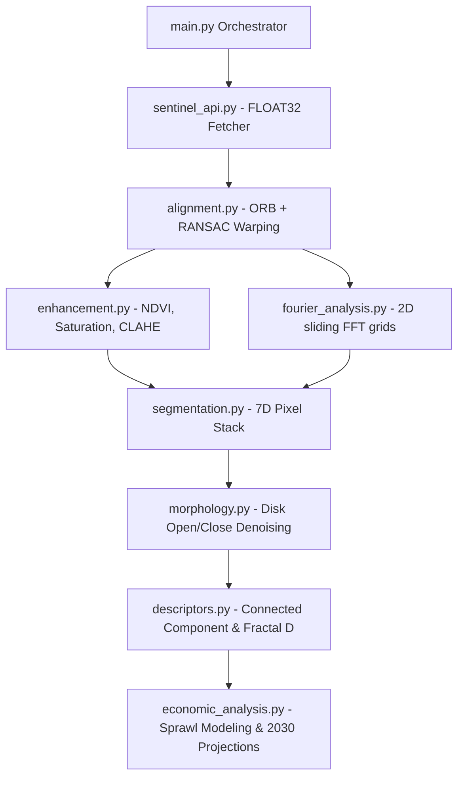

# Multi-Temporal Urban Growth & Nature Loss Analysis

An advanced remote-sensing image processing and machine learning pipeline that tracks urban sprawl, vegetation loss, and spatial complexity using **Copernicus Sentinel-2 L2A** satellite imagery. 

Developed modularly in Python, this project is fully generalized, allowing you to run end-to-end multi-temporal land-cover classification for **any geographical coordinates, custom study grid sizes, and list of target years on Earth.**

---

## 🛰️ Modular System Architecture & Mathematics

The system is structured as a series of isolated, academic-grade image processing pipelines coordinated by a central orchestrator:



### 1. Data Acquisition (`src/sentinel_api.py`)
Queries the Copernicus Sentinel Hub to fetch **raw FLOAT32 surface reflectance** bands rather than compressed 8-bit visual values, providing maximum radiometric resolution:
* **Bands Retrieved**: B02 (Blue), B03 (Green), B04 (Red), B08 (Near-Infrared), and DataMask.
* **Sampling**: Conducted during summer intervals (June 1 – August 31) with a cloud cover limit ($<5\%$) to isolate clear canopy signatures.

### 2. Sub-Pixel Keypoint Alignment (`src/alignment.py`)
To account for subtle satellite orbit drifts and preserve coordinate integrity across years, we register all target years to the oldest year's reference frame:
* Extracts **ORB (Oriented FAST and Rotated BRIEF)** features.
* Matches descriptors using a Brute-Force KNN matcher filtered by **Lowe's ratio test** ($dist < 0.75 \cdot dist_{next}$).
* Estimates a perspective Homography matrix $\mathbf{H}$ using **RANSAC** outlier rejection, warping all 5 channels via bilinear perspective transformation.

### 3. Spectral Indexing & Contrast (`src/enhancement.py`)
* **NDVI (Normalized Difference Vegetation Index)**: Measures photosynthetic activity.
  $$\text{NDVI} = \frac{\text{B08 (NIR)} - \text{B04 (Red)}}{\text{B08 (NIR)} + \text{B04 (Red)}}$$
* **HSV Saturation**: Converts RGB to HSV space and extracts the Saturation channel, separating asphalt/built concrete (low saturation) from healthy foliage (high saturation).
* **LAB-Space CLAHE**: Converts visual bands to LAB and applies Contrast Limited Adaptive Histogram Equalization directly on the $L$ (Luminance) channel. This maximizes the visibility of street grids and building footprints without distorting spectral hues.

### 4. Sliding-Window 2D Fourier Textures (`src/fourier_analysis.py`)
Computes a **Fourier Spatial-Frequency Texture Index** to identify repeating geometric human layouts (housing blocks, orthogonal street grids) vs. isotropic nature:
* Slides a $64 \times 64$ window across the grayscale satellite image.
* Applies a **2D Hanning window** to eliminate edge spectral leakage.
* Computes the 2D FFT, shifts the zero-frequency component to the center, and sums the magnitude spectrum in a high-frequency band ($5 \text{ px} \le r \le 30 \text{ px}$).
* Re-scales the feature map back to the native $1000 \times 1000$ grid using **bicubic upsampling** to output a smooth Fourier Urban Index.

### 5. Unsupervised Multi-Spectral Segmentation (`src/segmentation.py` & `src/morphology.py`)
* Stacks every pixel into a **7-dimensional feature space**: $[R, G, B, \text{NIR}, \text{NDVI}, \text{Fourier Texture}, \text{Saturation}]$.
* Fits `scikit-learn`'s `KMeans(n_clusters=3)` on the $1,000,000$ pixels.
* **Deterministic Autolabeling**: Maps arbitrary cluster indexes based on physics:
  * Highest average NDVI $\rightarrow$ **Forest/Grass (Nature)**
  * Lowest average NIR $\rightarrow$ **Water**
  * Remaining $\rightarrow$ **Urban (Concrete/Sprawl)**
* **Morphological Denoising**: Refines binary masks via opening ($\mathbf{A} \circ \mathbf{B}$) to erase moving cars/shadows, and closing ($\mathbf{A} \bullet \mathbf{B}$) to merge disjointed roofs and streets into solid urban blocks.

### 6. Shape & Fractal Feature Descriptors (`src/descriptors.py`)
* Indexes discrete sprawl pockets using **Connected Component Labeling**.
* Calculates shape parameters: **Circularity** ($4\pi A / P^2$) and **Solidity** ($A / A_{hull}$).
* Computes the **Box-Counting Fractal Dimension ($D$)** of the urban fringe boundary to measure boundary complexity:
  $$\log_2 N(s) = -D \log_2 s + C$$

---

## 📁 Directory Structure

```
urban_growth_analysis/
│
├── main.py                 # Centralized Orchestrator CLI
├── pyproject.toml          # Scientific Python Dependencies & Config
├── README.md               # Project Documentation
├── todo.md                 # Roadmap & Handover Checklist
├── .env                    # Sentinel Hub Credentials (git-ignored)
│
├── presets/                # Isolated Master Preset Datasets (Read-Only)
│   ├── raw_2018.npy        # Warsaw 2018 master satellite array
│   ├── raw_2022.npy        # Warsaw 2022 master satellite array
│   └── raw_2025.npy        # Warsaw 2025 master satellite array
│
├── src/                    # Pipeline Modules
│   ├── sentinel_api.py     # Data Downloader
│   ├── alignment.py        # ORB/RANSAC Alignment
│   ├── enhancement.py      # NDVI, Saturation, CLAHE
│   ├── fourier_analysis.py # sliding 2D FFT Textures
│   ├── morphology.py       # Mathematical Morphology Filters
│   ├── descriptors.py      # Connected Components & Fractal D
│   └── segmentation.py     # K-Means Stack & Class Mapping
│
└── data/                   # General Running Maps, Composites & Outputs
    ├── raw_<year>.npy      # Raw multi-spectral bands (copied/fetched at runtime)
    ├── aligned_<year>.npy  # Aligned multi-spectral bands
    ├── ndvi_<year>.npy     # NDVI matrices
    ├── classified_<year>.npy # Final land-cover segmentation maps
    ├── visual_*.png        # Visual composite diagnostics
    ├── fourier_*.png       # FFT spectrum reports
    └── *_report_<year>.png # High-contrast spatial overlays
```

---

## ⚙️ Installation & Setup

We recommend using the **`uv`** Python package manager for fast, reliable setups:

1. **Clone & Navigate**:
   ```bash
   cd urban_growth_analysis
   ```
2. **Initialize & Install (Using standard Python & pip)**:
   ```bash
   python3 -m venv .venv
   source .venv/bin/activate
   pip install --upgrade pip
   pip install -r requirements.txt
   ```
   *(Or if using the ultra-fast **`uv`** package manager)*:
   ```bash
   uv venv --python 3.12
   source .venv/bin/activate
   uv pip install -e .
   ```
4. **Configure Credentials**:
   Create a `.env` file in the root directory:
   ```env
   SH_CLIENT_ID=your_sentinel_hub_client_id
   SH_CLIENT_SECRET=your_sentinel_hub_client_secret
   ```

---

## 🚀 Execution & Command Reference

The central orchestrator `main.py` is fully parameter-driven and lets you select the dataset execution mode explicitly:

### 1. Default Warsaw Run (Zero-Config Offline Mode)
Runs the entire pipeline (ORB keypoints registration, enhancement calculations, sliding-window 2D FFT, and unsupervised KMeans clustering) entirely locally using the pre-cached Warsaw dataset. **No Sentinel Hub API credentials or `.env` setup are required!**
```bash
PYTHONPATH=. uv run python3 main.py
```
*(This is equivalent to explicitly running `PYTHONPATH=. uv run python3 main.py --dataset warsaw`)*

### 2. Custom Study Area Run (Online Mode)
Fetches fresh, high-resolution multi-spectral imagery directly from Sentinel Hub API for any location, coverage width, and year timeline. **Requires valid API keys to be configured in `.env`:**
```bash
PYTHONPATH=. uv run python3 main.py --dataset custom --lat 48.8566 --lon 2.3522 --distance 15.0 --years "2019,2022,2025"
```

> [!TIP]
> **Data Protection Safety**: The master Warsaw pre-cached raw datasets are kept entirely isolated inside the `presets/` folder. Running a custom location will fetch its files directly inside `data/` and will never risk overwriting or corrupting your default master Warsaw presets! If you'd like to save a custom run to a different folder, simply supply the `--data_dir` flag (e.g., `--data_dir data_paris`).

---

## 📊 Scientific Metrics: Warsaw Baseline (2018–2025)

The pipeline produces the following multi-temporal results for Warsaw ($52.2297$, $21.0122$):

* **Urban Area Expansion**: Built-up concrete expanded from **$29.38\text{ km}^2$ ($29.38\%$)** in 2018 to **$33.23\text{ km}^2$ ($33.23\%$)** in 2025, which represents a **$+13.1\%$ relative increase** in built-up footprints.
* **Nature Loss**: Warsaw lost **$2.79\text{ km}^2$ of natural carbon-sinks** (forest/grass canopy cover reduced from $32.18\%$ to $29.38\%$).
* **Fringe Fractal Complexity**: Calculated boundary fractal dimension values ($D \approx 1.875$) perfectly capture the irregular, highly complex interface of sprawling city boundaries.
