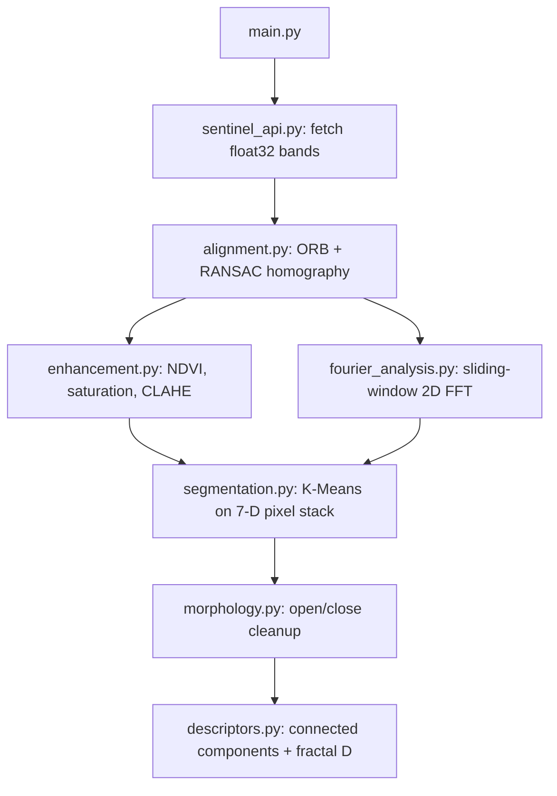

# Multi-Temporal Urban Growth and Nature Loss Analysis

A Python pipeline that tracks urban sprawl and vegetation loss from
Copernicus **Sentinel-2 L2A** imagery. It works on any coordinates,
study area size and list of years.

## Pipeline overview



### 1. Data acquisition — [src/sentinel_api.py](src/sentinel_api.py)
Pulls raw FLOAT32 surface-reflectance bands from Sentinel Hub instead
of compressed 8-bit visuals, so the spectral indices stay precise.

- Bands: B02 (blue), B03 (green), B04 (red), B08 (NIR), data mask.
- Time window: June 1 – August 31, max 5% cloud cover.

### 2. Alignment — [src/alignment.py](src/alignment.py)
Each target year is warped onto the oldest year so pixel-by-pixel
comparison is meaningful.

- ORB keypoints + brute-force KNN matcher with Hamming distance.
- Lowe's ratio test (`dist < 0.75 * dist_next`) to drop ambiguous matches.
- Homography estimated with RANSAC; all 5 bands warped with bilinear
  interpolation.

### 3. Spectral features — [src/enhancement.py](src/enhancement.py)
- **NDVI** = (NIR − Red) / (NIR + Red).
- **HSV saturation**: separates grey concrete from vivid foliage.
- **CLAHE on LAB-L**: boosts edge contrast without shifting colors.

### 4. Texture — [src/fourier_analysis.py](src/fourier_analysis.py)
Slides a 64×64 window over the grayscale image, applies a 2D Hanning
window, takes the 2D FFT and sums the magnitudes in a mid-frequency
ring (5 px ≤ r ≤ 30 px). The result is rescaled to the native
1000×1000 grid with bicubic interpolation.

### 5. Segmentation — [src/segmentation.py](src/segmentation.py) and [src/morphology.py](src/morphology.py)
- Per-pixel feature vector: `[R, G, B, NIR, NDVI, FFT texture, saturation]`.
- `KMeans(n_clusters=3)` over the 1 000 000 pixels.
- Cluster IDs are mapped to classes by centroid:
  - highest mean NDVI → forest/grass
  - lowest mean NIR → water
  - the remaining cluster → urban
- Each class mask is cleaned with disk open/close operations.

### 6. Shape and fractal descriptors — [src/descriptors.py](src/descriptors.py)
- Connected components on the urban mask.
- Circularity = 4πA / P², solidity = A / A_hull per patch.
- Box-counting fractal dimension of the urban boundary.

## Directory structure

```
urban_growth_analysis/
├── main.py                 # CLI entry point
├── pyproject.toml          # dependencies and project config
├── README.md
├── requirements.txt
├── .env                    # Sentinel Hub credentials (git-ignored)
├── presets/                # read-only Warsaw raw arrays
│   ├── raw_2018.npy
│   ├── raw_2022.npy
│   └── raw_2025.npy
├── src/
│   ├── sentinel_api.py
│   ├── alignment.py
│   ├── enhancement.py
│   ├── fourier_analysis.py
│   ├── morphology.py
│   ├── descriptors.py
│   └── segmentation.py
└── data/                   # runtime outputs
    ├── raw_<year>.npy
    ├── aligned_<year>.npy
    ├── ndvi_<year>.npy
    ├── fourier_<year>.npy
    ├── saturation_<year>.npy
    ├── classified_<year>.npy
    ├── visual_*.png
    └── *_report_<year>.png
```

## Setup

With standard Python + pip:

```bash
cd urban_growth_analysis
python3 -m venv .venv
source .venv/bin/activate
pip install --upgrade pip
pip install -r requirements.txt
```

Or with [uv](https://github.com/astral-sh/uv):

```bash
uv venv --python 3.12
source .venv/bin/activate
uv pip install -e .
```

For custom areas you also need a `.env` file:

```env
SH_CLIENT_ID=your_sentinel_hub_client_id
SH_CLIENT_SECRET=your_sentinel_hub_client_secret
```

## Running the pipeline

### Warsaw preset (no credentials needed)

```bash
PYTHONPATH=. uv run python3 main.py
```

Equivalent to `PYTHONPATH=. uv run python3 main.py --dataset warsaw`.

### Custom area (uses Sentinel Hub)

```bash
PYTHONPATH=. uv run python3 main.py \
  --dataset custom \
  --lat 48.8566 --lon 2.3522 \
  --distance 15.0 \
  --years "2019,2022,2025"
```

> The Warsaw preset arrays live in `presets/` and are never overwritten.
> A custom run writes only to `data/`. Use `--data_dir data_paris` (or
> any other folder) to keep separate study areas side by side.

## Warsaw baseline results (2018–2025)

- Urban footprint grew from **29.38 km² (29.38%)** in 2018 to
  **33.23 km² (33.23%)** in 2025, a relative increase of about **13.1%**.
- Forest and grass cover dropped by **2.79 km²**
  (from 32.18% to 29.38%).
- Boundary fractal dimension stays around **D ≈ 1.875**, which
  reflects the very irregular interface of the sprawling fringe.
